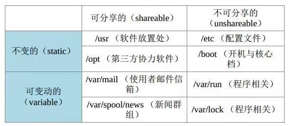

# 2.1 收获

## Linux

CPU架构主要两种：精简指令集(RISC)与复杂指令集(CSIC)

RISC架构的主要是ARM CPU

CISC架构主要是x86的CPU


i386芯片是几乎最早的32位intelCPU 我们虚拟机的芯片就是模拟这个的

i686芯片也是32位的

不同芯片集成的新的微指令集只是用来加强硬件性能或者功能，不会影响基础软件运行环境(导致软件不能运行)

目前的64位CPU统称为x86_64


由于计算机硬件与操作系统核心关系很强烈，在早期的程序员是没有明确的操作系统的概念的，导致很多开发出的软件与操作系统依赖关系紧密，不能方便的移植。

最开始的Linux仅针对i386芯片，仅是一套操作系统，然后被人不断的丰富软件与操作平台才发展成现在的样子。

现在市面上很多Linux系统的名字 Ubuntu，cenOS，Red Hat等

这些都是发行商版本 其核心都是按照同样标准的Linux内核

只是集成了不同的软件和工具而已

## work

对Linux系统的操作更熟练了吧，又接触了两个新东西XamarinStudio + mono ——可以编译跨平台exe

学会了SciTE的配置

发现C#的文件流操作文件还是很快的，原以为效率不高，但是在操作小于200M的文件的时候还是蛮快的，慢的是将string显示出来的textview的过程

用了公司的Typora 发现比家里的macdown好用多了啊。以后就用这个了

明天学习MobaXterm 

## leecode

[888](https://leetcode-cn.com/problems/fair-candy-swap/) [公平的糖果](https://leetcode-cn.com/problems/fair-candy-swap/)

简单题，先排序nlogn，然后双指针依次往后

## Linux

今天直接从Linux的文件权限 第五章开始看

奇怪：Linux切换到root的时候 su - 的“-”前后都要加空格 醉了——Ubuntu

ls -al是观看群组和权限

chgrp chown chmod

-rwxrwxrwx

x:操作，执行

Linux没有所谓的扩展名的概念 只有执行权限

及时是基本难得文本文件也能设置x执行权限然后执行，只是不能执行成功而已。



HFS标准

第五章结束

## labuladong的算法小抄

92.[反转链表](https://leetcode-cn.com/problems/reverse-linked-list-ii/submissions/)

层层递进

**递归递归  递进然后回归** 

```c++
/**
 * Definition for singly-linked list.
 * struct ListNode {
 *     int val;
 *     ListNode *next;
 *     ListNode() : val(0), next(nullptr) {}
 *     ListNode(int x) : val(x), next(nullptr) {}
 *     ListNode(int x, ListNode *next) : val(x), next(next) {}
 * };
 */
    ListNode* succesor = nullptr;// 连接作用
    ListNode* reverse(ListNode* head, int n)
    {
        if(n == 1)
        {
            succesor = head->next;
            return head;
        }

        ListNode* last = reverse(head->next, n - 1);
        head->next->next = head;
        head->next = succesor;
        return last;
    }

class Solution {
public:
    ListNode* reverseBetween(ListNode* head, int m, int n) {
        if(m == 1)
            return reverse(head, n);
        // 仔细感受这里的递归思想，下面这句话是精髓
        head->next = reverseBetween(head->next, m - 1, n - 1);
        return head;
    }
};
```

206 反转链表 **迭代** 下面的模板要像1+1一样记得，理解每个节点移动的过程

```c++
ListNode* reverseList(ListNode* head) {
       ListNode* cur = head;
       ListNode* ntx = head;
       ListNode* pre = nullptr;
       while(cur != nullptr)
       {
            ntx = cur->next;// ntx的作用是一直存未处理的链表头

            cur->next = pre;
            pre = cur;
            cur = ntx;
            //pre->next = nullptr;
            
       }
       return pre;
    }
```

[25.K个一组翻转链表（困难）](https://leetcode-cn.com/problems/reverse-nodes-in-k-group)

递归迭代结合 感觉这题不太算递归啊，有点划窗的感觉 k个划窗依次往后遍历 反转

```c++
class Solution {
public:
    ListNode* reverseKGroup(ListNode* head, int k) {
        if(head == nullptr)
            return head;
        ListNode* start = head;
        ListNode* end = head;
        for(int i = 0;i < k;++i)
        {
            if(end == nullptr) return head;
            end = end->next;
        }

        ListNode* newHead = reverse(start, end);
        start->next = reverseKGroup(end, k);
        return newHead;
    }
};
```

[234.回文链表（简单）](https://leetcode-cn.com/problems/palindrome-linked-list)

主要是先序遍历和后序遍历的结构很厉害

```c++
class Solution {
public:
    bool res = true;
    ListNode* left = nullptr;

    // 后序遍历
    bool travers(ListNode* node)
    {
        if(node == nullptr) return true;
        //travers(node->next);
        // 后序 只有走了最后一个节点才能走到这里，真的妙
        res = travers(node->next) & (node->val == left->val);
        left = left->next;
        return res;
    }
    bool isPalindrome(ListNode* head) {
        left = head;

        ListNode* right = head;
        return travers(right);
    }
};
```

明天开始看labuladong的二叉树
